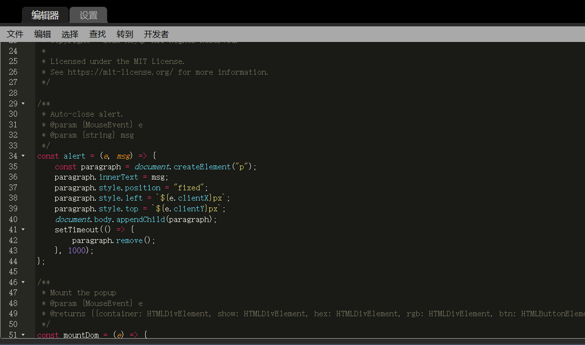

# Browser-Color-Picker

## Introduction

## Install

- install the tampermonkey plugin of browser.
- new a script.
	
- copy the content of dist/browser-color-picker.js into it.
	
- just save it (ctrl + s)

## Usage
